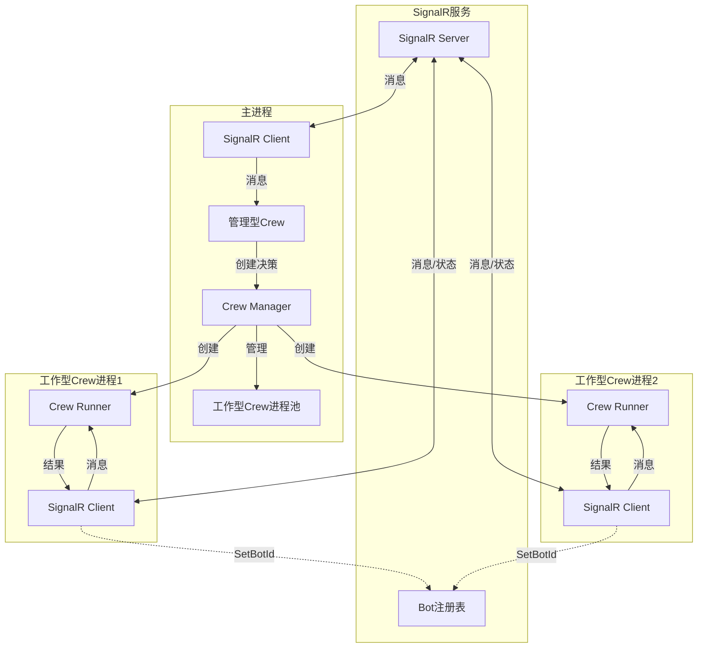
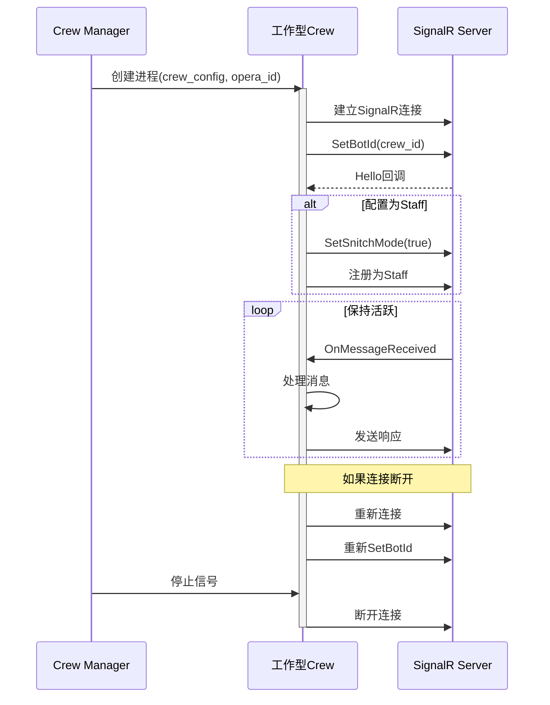
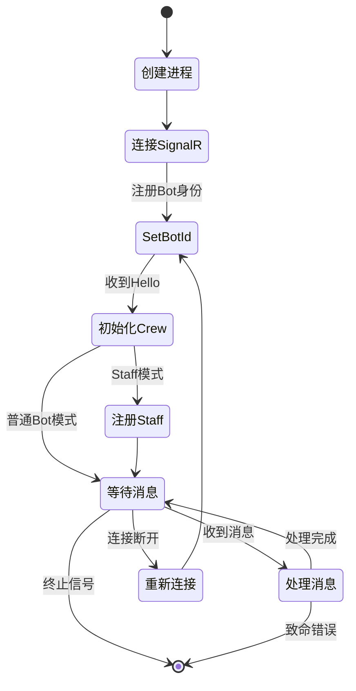

什么需要连接SignalR：
一个能创建Crew的Crew
正在工作的Crew，此时发送的消息就直接给到这个Crew。
Crew Management： 是不是可以直接tmp文件保存context再通过@crew config来传入？

需要缓存什么样的数据？
Crew的工作记录，历史信息。

```mermaid
graph TD
    subgraph SignalR服务
        SR[SignalR Server]
        BotRegistry[Bot注册表]
    end

    subgraph 主进程
        MC[管理型Crew]
        SRC[SignalR Client]
        CM[Crew Manager]
        
        SRC -->|消息| MC
        MC -->|创建决策| CM
        CM -->|管理| WCP[工作型Crew进程池]
    end

    subgraph 工作型Crew进程1
        WC1[Crew Runner]
        SC1[SignalR Client]
        WC1 -->|结果| SC1
        SC1 -->|消息| WC1
        SC1 -.->|SetBotId| BotRegistry
    end

    subgraph 工作型Crew进程2
        WC2[Crew Runner]
        SC2[SignalR Client]
        WC2 -->|结果| SC2
        SC2 -->|消息| WC2
        SC2 -.->|SetBotId| BotRegistry
    end

    SR <-->|消息| SRC
    SR <-->|消息/状态| SC1
    SR <-->|消息/状态| SC2
    
    CM -->|创建| WC1
    CM -->|创建| WC2
```

工作型Crew的连接流程：

```mermaid
sequenceDiagram
    participant CM as Crew Manager
    participant WC as 工作型Crew
    participant SR as SignalR Server
    
    CM->>WC: 创建进程(crew_config, opera_id)
    activate WC
    WC->>SR: 建立SignalR连接
    WC->>SR: SetBotId(crew_id)
    SR-->>WC: Hello回调
    
    alt 配置为Staff
        WC->>SR: SetSnitchMode(true)
        WC->>SR: 注册为Staff
    end
    
    loop 保持活跃
        SR->>WC: OnMessageReceived
        WC->>WC: 处理消息
        WC->>SR: 发送响应
    end
    
    Note over SR,WC: 如果连接断开
    WC->>SR: 重新连接
    WC->>SR: 重新SetBotId
    
    CM->>WC: 停止信号
    WC->>SR: 断开连接
    deactivate WC
```
工作型Crew生命周期

```mermaid
stateDiagram-v2
    [*] --> 创建进程
    创建进程 --> 连接SignalR
    连接SignalR --> SetBotId: 注册Bot身份
    SetBotId --> 初始化Crew: 收到Hello
    
    初始化Crew --> 等待消息: 普通Bot模式
    初始化Crew --> 注册Staff: Staff模式
    注册Staff --> 等待消息
    
    等待消息 --> 处理消息: 收到消息
    处理消息 --> 等待消息: 处理完成
    
    等待消息 --> 重新连接: 连接断开
    重新连接 --> SetBotId
    
    等待消息 --> [*]: 终止信号
    处理消息 --> [*]: 致命错误
```