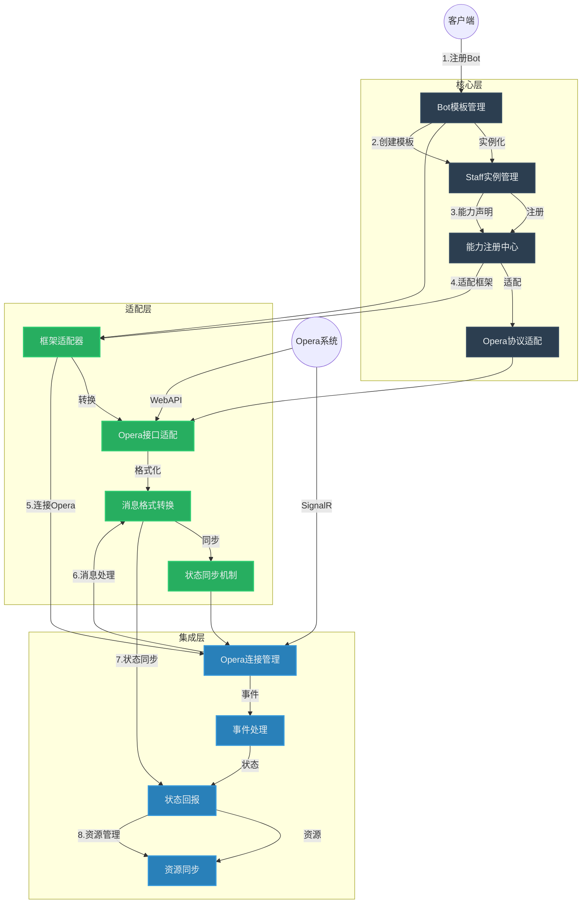

```mermaid
graph TB
    subgraph 核心层
        BT[Bot模板管理] --> |实例化| SI[Staff实例管理]
        SI --> |注册| CR[能力注册中心]
        CR --> |适配| OA[Opera协议适配]
    end

    subgraph 适配层
        FA[框架适配器] --> |转换| OIA[Opera接口适配]
        OIA --> |格式化| MF[消息格式转换]
        MF --> |同步| SS[状态同步机制]
    end

    subgraph 集成层
        OCM[Opera连接管理] --> |事件| EH[事件处理]
        EH --> |状态| SR[状态回报]
        SR --> |资源| RS[资源同步]
    end

    %% 层级间的关系
    BT --> FA
    OA --> OIA
    SS --> OCM

    %% 关键流程
    Client((客户端)) --> |1.注册Bot| BT
    BT --> |2.创建模板| SI
    SI --> |3.能力声明| CR
    CR --> |4.适配框架| FA
    FA --> |5.连接Opera| OCM
    OCM --> |6.消息处理| MF
    MF --> |7.状态同步| SR
    SR --> |8.资源管理| RS

    %% 外部系统
    Opera((Opera系统)) --> |SignalR| OCM
    Opera --> |WebAPI| OIA

    classDef core fill:#2C3E50,color:#ECF0F1,stroke:#34495E,stroke-width:2px
    classDef adapter fill:#27AE60,color:#ECF0F1,stroke:#2ECC71,stroke-width:2px
    classDef integration fill:#2980B9,color:#ECF0F1,stroke:#3498DB,stroke-width:2px
    
    class BT,SI,CR,OA core
    class FA,OIA,MF,SS adapter
    class OCM,EH,SR,RS integration

```