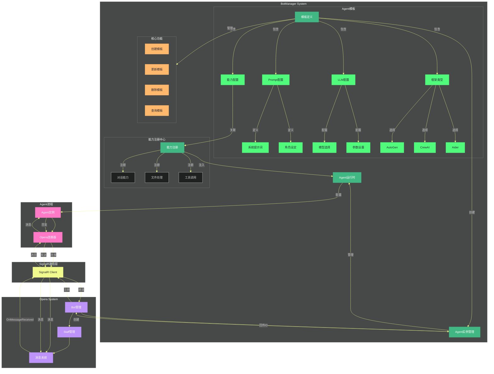

```mermaid
%%{init: {
  'theme': 'dark',
  'themeVariables': {
    'fontFamily': 'arial',
    'fontSize': '14px',
    'primaryColor': '#41B883',
    'primaryTextColor': '#fff',
    'primaryBorderColor': '#41B883',
    'lineColor': '#F1FA8C',
    'secondaryColor': '#FF79C6',
    'tertiaryColor': '#BD93F9',
    'coreFunctionColor': '#FFB86C'
  }
}}%%

graph TD
    %% 定义样式
    classDef botManager fill:#41B883,stroke:#41B883,color:#fff
    classDef agent fill:#FF79C6,stroke:#FF79C6,color:#fff
    classDef opera fill:#BD93F9,stroke:#BD93F9,color:#fff
    classDef signalr fill:#F1FA8C,stroke:#F1FA8C,color:#282A36
    classDef template fill:#50FA7B,stroke:#50FA7B,color:#282A36
    classDef coreFunction fill:#FFB86C,stroke:#FFB86C,color:#282A36

    subgraph BotManager["BotManager System"]
        subgraph AgentTemplate["Agent模板"]
            T[模板定义] --> |包含|P[Prompt配置]
            T --> |包含|L[LLM配置]
            T --> |包含|F[框架类型]
            T --> |包含|C[能力配置]
            
            P --> |定义|P1[系统提示词]
            P --> |定义|P2[角色设定]
            
            L --> |配置|L1[模型选择]
            L --> |配置|L2[参数设置]
            
            F --> |选择|F1[AutoGen]
            F --> |选择|F2[CrewAI]
            F --> |选择|F3[Aider]
        end

        %% 新增核心功能子图
        subgraph CoreFunctions["核心功能"]
            CF1[创建模板]
            CF2[更新模板]
            CF3[删除模板]
            CF4[查询模板]
        end

        T --> |管理|CoreFunctions
        T --> |创建|I[Agent实例管理]
        I --> |管理|R[Agent运行时]
        
        %% 新增能力注册中心子图
        subgraph CapabilityRegistry["能力注册中心"]
            D[能力注册]
            D --> |注册|C1[对话能力]
            D --> |注册|C2[文件处理]
            D --> |注册|C3[工具调用]
        end

        D --> |注入|R
        C --> |关联|D
    end

    subgraph Agent["Agent进程"]
        E[Agent实例] --> H[Opera连接器]
    end

    subgraph SignalR["SignalR通信层"]
        S1[SignalR Client]
    end

    subgraph Opera["Opera System"]
        O1[Bot管理] --> O2[Staff管理]
        O2 --> O3[消息系统]
    end

    %% 连接关系
    H --> |连接|S1
    S1 --> |消息|O3
    I --> |创建|O1
    O1 --> |回传ID|I
    R --> |配置|E

    %% 新增的通信路径
    O1 --> |注册|S1
    S1 --> |邀请|O1

    %% 消息流转
    O3 --> |OnMessageReceived|S1
    S1 --> |消息|H
    H --> |消息|E
    E --> |回复|H
    H --> |发送|S1
    S1 --> |消息|O3

    %% 应用样式
    class T,I,R,D botManager
    class P,L,F,P1,P2,L1,L2,F1,F2,F3,C template
    class E,H agent
    class O1,O2,O3 opera
    class S1 signalr
    class CF1,CF2,CF3,CF4 coreFunction
```