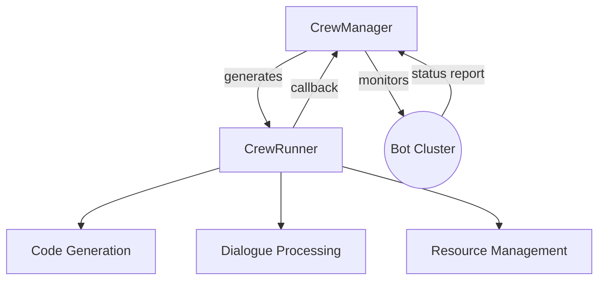

# Nebular

Nebular is a Python-based AI assistant experimental platform that integrates various modern AI tools and frameworks for exploring and developing intelligent assistant applications.

## 🌟 Core Capabilities

### Intelligent System Architecture

## 🚀 Implementation Architecture

**Layered Process Architecture**:
   - Manager Layer: Responsible for resource scheduling and monitoring
   - Runner Layer: Focused on specific task execution
   - Process isolation achieved through multiprocessing

### Modular Design

| Module Path | Responsibility |
|------------|----------------|
| `src/core/` | Core runtime and base classes |
| `src/crewai_ext/` | CrewAI extension implementation |
| `src/opera_service/` | Business logic service layer |
| `config/` | Agent configuration management |

## Roadmap

- [ ] Refactor by MQ + FastAPI + Celery
- [ ] MCP support
- [ ] Agent Monitoring with OpenLIT/LangFuse, leveraged by crewai integration
- [ ] Recurring summon opera in complex flow
- [x] Implement Hierarchical Process based on CrewAI ✅
- [x] Basic process management framework ✅
- [x] Init Prompt Template by CrewManager Spawning
- [x] Leverage CrewAI [Hierarchical Process](https://docs.crewai.com/how-to/hierarchical-process), [Flows](https://docs.crewai.com/concepts/flows) ✅