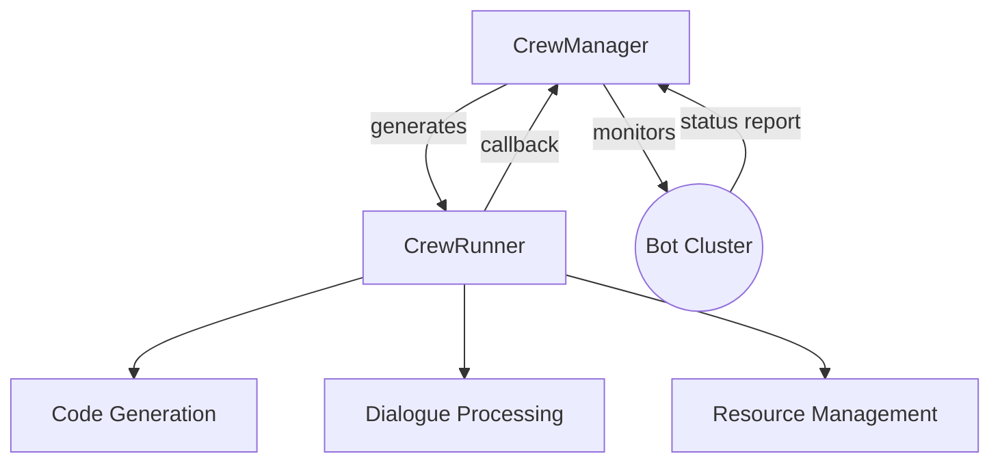

# Nebular

Nebular is a Python-based AI assistant experimental platform that integrates various modern AI tools and frameworks for exploring and developing intelligent assistant applications.

## 🌟 Core Capabilities

### Core Runtime System
|| Module | Description | Key Technologies |
|---|------|------------|-----------------|
| 🧠 | CrewManager | Main management process responsible for: - Sub-Bot lifecycle management - Distributed task routing - Resource dependency resolution | - Multi-process management - UUID addressing - Backoff retry strategy |
| ⚙️ | CrewRunner | Worker process responsible for: - Specific task execution - Code generation - Dialogue processing | - CrewAI integration - AST parsing - Semaphore control |
| 🛠️ | BotToolkit | Unified API toolset | - FastAPI wrapper - Unified response parsing |

### Intelligent System Architecture

## 🚀 Implementation Architecture

### Key Design Patterns
1. **Layered Process Architecture**:
   - Manager Layer: Responsible for resource scheduling and monitoring
   - Runner Layer: Focused on specific task execution
   - Process isolation achieved through multiprocessing

2. **Elastic Communication Mechanism**:
   - Built-in retry strategy (backoff.expo)
   - Cross-process state synchronization (via Bot defaultTags)

### Modular Design

| Module Path | Responsibility |
|------------|----------------|
| `src/core/` | Core runtime and base classes |
| `src/crewai_ext/` | CrewAI extension implementation |
| `src/opera_service/` | Business logic service layer |
| `config/` | Agent configuration management |

## 📊 Technology Stack Updates

|| Domain | Technology Choice |
|---|--------|-------------------|
| Framework Core | CrewAI Extension | Custom Agent base classes Process template engine |
| Communication Layer | Async IO | asyncio + SignalR |
| Reliability | Fault Tolerance | Backoff retry Process health checks |

## Roadmap
- [x] Implement Hierarchical Process based on CrewAI ✅
- [x] Basic process management framework ✅
- [ ] Init Prompt Template by CrewManager Spawning
- [ ] Recurring summon opera
- [x] Leverage CrewAI [Hierarchical Process](https://docs.crewai.com/how-to/hierarchical-process), [Flows](https://docs.crewai.com/concepts/flows) ✅
- [ ] CrewRunner more Tools
